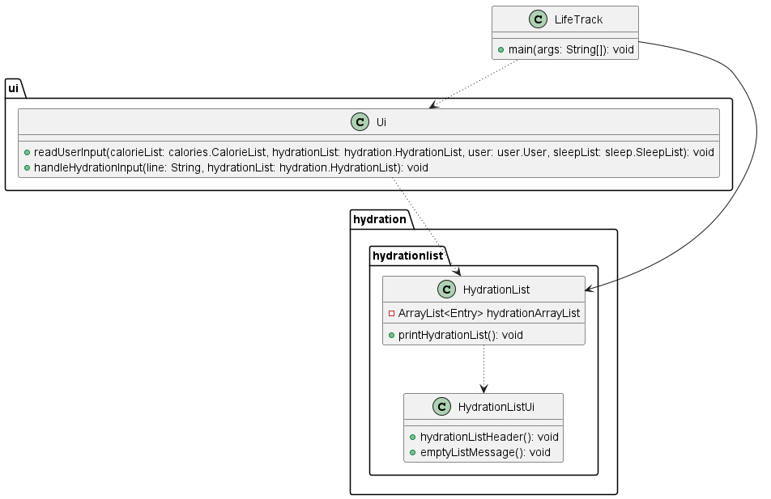
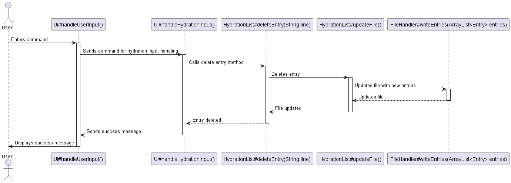

# Developer Guide

## Acknowledgements

{list here sources of all reused/adapted ideas, code, documentation, and third-party libraries -- include links to the original source as well}

## Design & implementation
### Adding calorie entries feature

#### Implementation

This functionality is facilitated by `UI`, `CalorieList`, `FileHandler` and `ParserCalories`. It implements one operation, namely:
- `UI#handleCaloriesInput(String, CalorieList)`
- `CalorieList#addEntry(String)`
- `ParserCalories#parseCaloriesInput(String)`
- `FileHandler#updateFile()`

This feature is activated when the user inputs a `calories in` or `calories out` command in the terminal.

Given below is an example usage scenario and how this mechanism behaves at every step:

- Step 1: When the user inputs the command `calories in burger c/200 d/2024-02-02` in the terminal,
the string is sent to `UI#handleCaloriesInput(String, CalorieList)`, which calls `CalorieList#addEntry(String)`.

- Step 2: Inside `CalorieList#addEntry(String)`, the function `ParserCalories#parseCaloriesInput(String)` is then called to extract information such as the description, number of calories, and date of entry.

- Step 3: The obtained information is sent to the private method `ParserCalories#makeNewInputEntry(String, int, String)` to create a new entry of class `InputEntry` that extends `Entry`. An `Entry` object is then returned to the caller, `CalorieList#addEntry(String)`.

- Step 4: The returned `Entry` object is added into the `calorieArrayList` member of type `ArrayList<Entry>` in the `CalorieList`, via the `ArrayList.add()` method.

- Step 5: `FileHandler#updateFile()` is then called to update the data file with the new entry in the `CalorieList`.

The sequence diagram for this feature is shown below:

### Calculating calorie requirements based on a user`s goals

#### Implementation

This functionality is facilitated by `UserGoals`. It implements one operation, namely:
- `UserGoals#getHealthInfo(User)`

This operation is exposed in the `User` class as `User#getHealhInfo()`.

Given below is an example usage scenario and how this mechanism behaves at every step:
- Step 1: When the user inputs the command `user progress` in the terminal,
  the string is sent to `User#getHealthInfo()`, which calls `UserGoals#getHealthInfo(User)`.

- Step 2: The method retrieves the user`s information such as his height, weight, age, gender, exercise levels and intended goal.

- Step 3: Using these information, the method creates a `requestBody` `String`. 

- Step 4: The created `requestBody` is used to send a `HttpRequest` to RapidAPI`s Fitness API, and the response is parsed to determine the number of calories a user needs to consume according to their personal goals.

- Step 5: This value is set to `User.caloriesRequired` by `User#setCaloriesRequired(int)`.

#### Design considerations

- **Alternative 1 (current choice):** Uses an API to get the calories needed
    - Pros: No need to figure out the optimal algorithm
    - Cons: Need to parse response to sieve out necessary information

- **Alternative 2:** Uses an algorithm to find the number of calories needed
  - Pros: Not dependent on external APIs
  - Cons: Need to come up with an algorithm to use

### Calories list feature

The `calories list` feature lists out the record of all the Calories data that the user has keyed in. The Calories data are all stored into a `ArrayList<Entry> calorieArrayList` attribute of the `CalorieList` Class. Calories data are printed when the `printCalorieList()` function is called. 

The `printCalorieList()` function iterates through the `calorieArrayList` and prints out the Entries according to its order in the Array List.

The Class diagram and sequence diagram for Calories list feature is shown below. Unrelated attributes and Classes were excluded.

### Calories delete feature

The `calories delete` feature can delete the calories record at specific index of calorie list. This functionality is facilitated by `CaloriesList`. It implements one operation, namely:
- `deleteEntry(String line)`

Given below is an example usage scenario and how this mechanism behaves at every step:
- Step 1: When the user inputs the command `calories delete INDEX` in the terminal, the string is sent to `Ui#handleUserInput()`, which will call `Ui#handleCaloriesInput()`.

- Step 2: After the `Ui#handleCaloriesInput()` matching `delete calories` key word, the string will be passed into deleteEntry(String line) to execute delete process.

- Step 3: The string will be divided to two substrings according to the command syntax. Index will be tried to get from the second substring by `Integer.parseInt()`.

- Step 4: The calories record (`Entry`) stored in the `ArrayList<Entry> caloriesList` will be deleted by calling `calorieArrayList.remove((index-1));` and a successful deleting message will be shown in terminal by calling `CalorieListUi#successfulDeletedMessage(toDelete)`

- Step 5: The latest calories list will be updated to saving file by calling `CalorieList#updateFile()`.

The Class diagram for Calories delete feature is shown below:

### Parsing user input for hydration entries

This functionality is facilitated by `ParserHydration`. It implements one operation, namely:
- `ParserHydration#parseHydrationInput(String input)`

This operation is exposed in the `HydrationList` class as `HydrationList#addEntry(String)`.

Given below is an example usage scenario and how this mechanism behaves at every step:
- Step 1: When the user inputs the command `hydration in Milo v/100 d/2022-01-02` in the terminal,
  the string is sent to `HydrationList#addEntry(String)`, which calls `ParserHydration#parseHydrationInput(String)`.

- Step 2: Using `String.split()`, the method extracts information such as the description, volume of beverage, and date of entry. The obtained information is sent to the private method `ParserHydration#makeNewInputEntry(String, int, String)` to create a new entry of class `HydrationEntry` that extends `Entry`.

- Step 3: The created `HydrationEntry` instance is added into the `ArrayList<Entry>` attribute of the `HydrationList`.

### Calculating hydration requirements for each user

#### Design Considerations

**General Health Guidelines:** The recommended daily intake of water for an average adult is around 8 glasses or approximately 2000 milliliters. This guideline is commonly recommended by health authorities and organizations such as HealthHub.

**Ease of Implementation:** Setting a standard hydration requirement simplifies the tracking process for users. It provides a clear goal to strive for, making it easier for individuals to monitor and maintain their hydration levels consistently.
### Hydration list feature

The `hydration list` feature lists out the record of all the Hydration data that the user has keyed in. The Hydration data are all stored into a `ArrayList<Entry> hydrationArrayList` attribute of the `HydrationList` Class. Hydration data are printed when the `printHydrationList()` function is called.

The `printHydrationList()` function iterates through the `hydrationArrayList` and prints out the Entries according to its order in the Array List.

The Class diagram for Hydration list feature is shown below. Unrelated attributes and Classes were excluded.

### Hydration delete feature

The `hydration delete` feature can delete the hydration record at specific index of hydration list. This functionality is facilitated by `HydrationList`. It implements one operation, namely:
- `deleteEntry(String line)`

Given below is an example usage scenario and how this mechanism behaves at every step:
- Step 1: When the user inputs the command `hydration delete INDEX` in the terminal, the string is sent to `Ui#handleUserInput()`, which will call `Ui#handleHydrationInput()`.

- Step 2: After the `Ui#handleHydrationInput()` matching `delete hydration` key word, the string will be passed into deleteEntry(String line) to execute delete process.

- Step 3: The string will be divided to two substrings according to the command syntax. Index will be tried to get from the second substring by `Integer.parseInt()`.

- Step 4: The hydration record (`Entry`) stored in the `ArrayList<Entry> hydrationList` will be deleted by calling `hydrationArrayList.remove((index-1));` and a successful deleting message will be shown in terminal by calling `HydrationListUi#successfulDeletedMessage(toDelete)`

- Step 5: The latest hydration list will be updated to saving file by calling `HydrationList#updateFile()`.

The Sequence diagram for Hydration delete feature is shown below:

## Product scope
### Target user profile

{Describe the target user profile}

### Value proposition

{Describe the value proposition: what problem does it solve?}

## User Stories

|Version| As a ... | I want to ... | So that I can ...|
|--------|----------|---------------|------------------|
|v1.0|new user|see usage instructions|refer to them when I forget how to use the application|
|v2.0|user|find a to-do item by name|locate a to-do without having to go through the entire list|

## Non-Functional Requirements

{Give non-functional requirements}

## Glossary

* *glossary item* - Definition

## Instructions for manual testing

{Give instructions on how to do a manual product testing e.g., how to load sample data to be used for testing}
